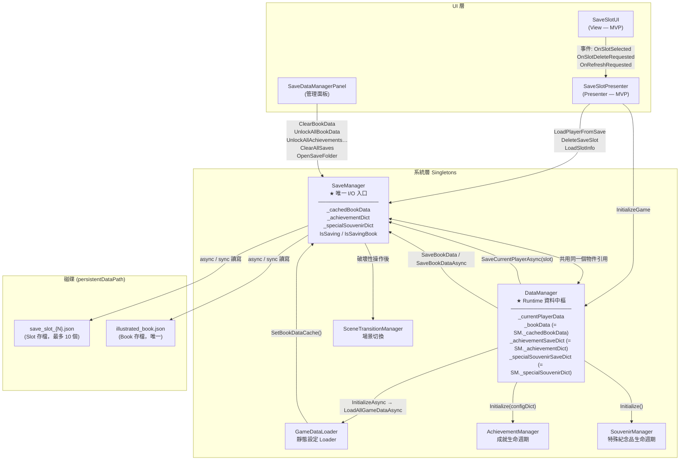
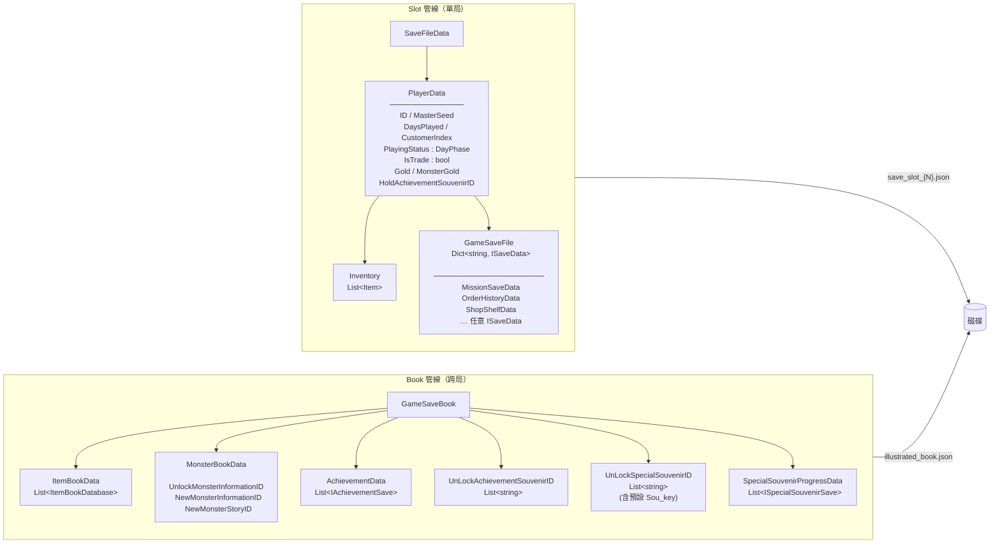
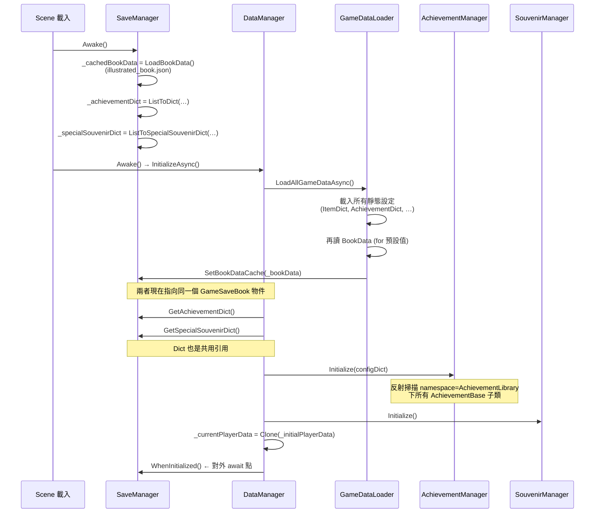
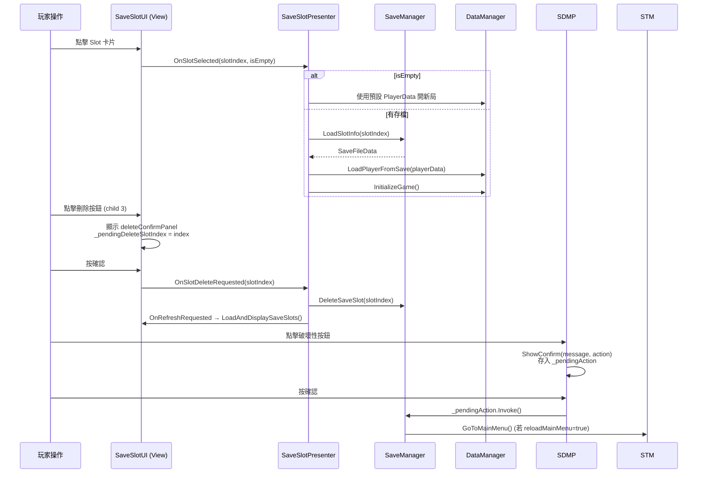
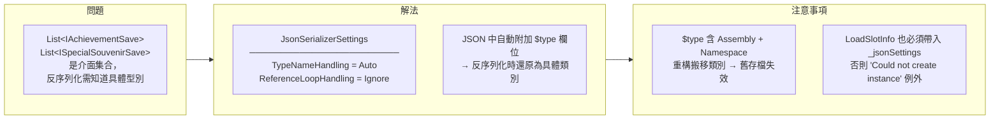
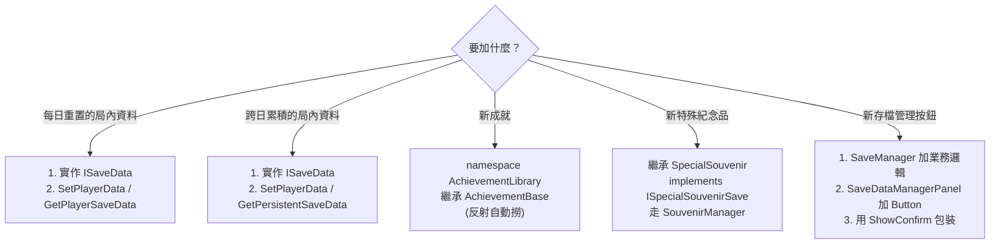

# 存檔系統架構圖

> 對應版本：2026-04-15  
> 專案：RED / ForTest

---

## 1. 整體元件關係



---

## 2. 雙管線存檔結構



---

## 3. 資料介面層級

```mermaid
classDiagram
    class ISaveData {
        <<interface>>
        +string UniqueID
        +int LastUpdatedDay
    }
    class MissionSaveData { +UniqueID +LastUpdatedDay }
    class OrderHistoryData { +UniqueID +LastUpdatedDay }
    class ShopShelfData   { +UniqueID +LastUpdatedDay }
    ISaveData <|.. MissionSaveData
    ISaveData <|.. OrderHistoryData
    ISaveData <|.. ShopShelfData

    class IAchievementSave {
        <<interface>>
        +string AchievementID
        +bool IsCompleted
        +int FinishDay
    }
    class IAchievementWithProgress {
        <<interface>>
        +int CurrentProgress
        +int TargetProgress
    }
    class AchievementBase {
        <<abstract>>
        (namespace AchievementLibrary)
    }
    IAchievementSave <|-- IAchievementWithProgress
    IAchievementWithProgress <|.. AchievementBase

    class ISpecialSouvenirSave {
        <<interface>>
        +string SouvenirID
        +bool IsCompleted
        +int CurrentProgress
        +int TargetProgress
    }
    IAchievementWithProgress <|-- ISpecialSouvenirSave
    ISpecialSouvenirSave <|.. SpecialSouvenir
```

---

## 4. 啟動初始化流程



---

## 5. 存檔寫入路徑

```mermaid
flowchart TD
    subgraph PlayerSave["Slot 存檔路徑"]
        A1["DataManager.SaveCurrentPlayerAsync(slot)"]
        A2{"IsSaving?"}
        A3["SM.SaveGameAsync(playerData, slot)"]
        A4["JSON Clone → snapshot"]
        A5["save_slot_{slot}.json"]
        A1 --> A2
        A2 -->|"Yes → 跳過"| END1["略過 (警告 Log)"]
        A2 -->|"No"| A3
        A3 --> A4 --> A5
    end

    subgraph BookSave["Book 存檔路徑"]
        B1["DM mutator 呼叫<br/>(UnlockMonsterInfo / AddItemToBook / …)"]
        B2["mutate _bookData (共用物件)"]
        B3["SM.SaveBookData(_bookData) 同步"]
        B4["illustrated_book.json"]
        B5["DictToList(_achievementDict)<br/>→ bookData.AchievementData"]
        B6["DictToList(_specialSouvenirDict)<br/>→ bookData.SpecialSouvenirProgressData"]
        B1 --> B2 --> B5 --> B6 --> B3 --> B4
    end

    subgraph AsyncBookSave["Book 非同步路徑（少用）"]
        C1["SM.SaveBookDataAsync(bookData)"]
        C2{"IsSavingBook?"}
        C3["await WriteAllTextAsync"]
        C1 --> C2
        C2 -->|"Yes → 跳過"| END2["略過"]
        C2 -->|"No"| C3
    end
```



---

## 6. UI 層 MVP 互動



---

## 7. JSON 序列化策略



---

## 8. 破壞性操作一覽

| 方法 | 影響 Slot | 影響 Book | 重新載入場景 |
|---|:---:|:---:|:---:|
| `DeleteSaveSlot(slot)` | ✅ 單個 | ✗ | ✗ |
| `ClearBookData()` | ✗ | ✅ 全清 (保留 Sou_key) | ✅ |
| `UnlockAllBookData()` | ✗ | ✅ 全解鎖圖鑑 | ✅ |
| `UnlockAllAchievementsAndSpecialSouvenirs()` | ✗ | ✅ 全解鎖成就+紀念品 | ✅ |
| `ClearAllSaves()` | ✅ 全部 | ✅ 全清 | ✅ |
| `OpenSaveFolder()` | ✗ | ✗ | ✗ |

> 所有破壞性操作在 `SaveDataManagerPanel` 都經過 `ShowConfirm()` 二次確認才執行。

---

## 9. 擴充指引速查


